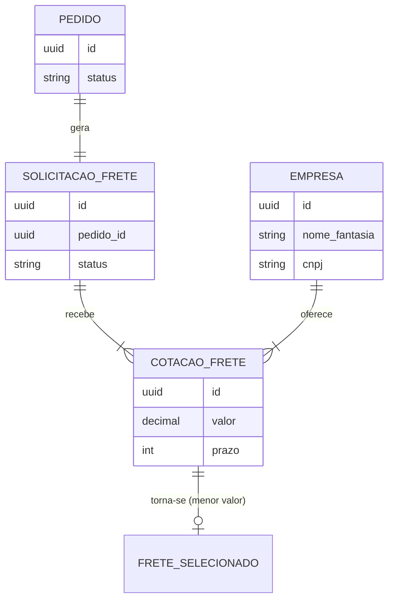

# Logística Service — Portal B2B (Equipe 8)

> Microsserviço de Logística do Portal B2B — CMP1896 Sistemas Distribuídos (PUC-GO)

## Estado do Projeto: Integração Completa

O serviço de Logística encontra-se **100% integrado** ao ecossistema de produção do Portal B2B.

- **Conectividade Validada**: Comunicação em tempo real estabelecida e estabilizada com o banco de dados oficial **PostgreSQL (Cloud SQL)** e o cluster **Kafka** compartilhado com 3 brokers.
- **Dashboard Remodelado**: A interface de visualização (front-end) foi totalmente reestruturada para uma experiência profissional, contando agora com um **layout de duas colunas**, suporte nativo a **scroll vertical** para grandes volumes de dados e **mapeamento inteligente de nomes amigáveis** para as transportadoras oficiais cadastradas.

---

## Pilha Tecnológica (Tech Stack)

A infraestrutura e o código da aplicação foram desenvolvidos com as seguintes tecnologias:

- **Backend**: Python 3.12, FastAPI, SQLAlchemy (Async), AioKafka.
- **Frontend**: React, Tailwind CSS (Layout de 2 colunas, Grid Responsiva).
- **Infraestrutura**: Docker, Docker Compose, Nginx (Gateway).

---

## Comandos de Infraestrutura (Build & Deploy)

Para garantir um ambiente íntegro e previsível, utilizamos os seguintes comandos padrão de manutenção e reset.

**Manutenção e Reset**

```bash
# Reset total (Remoção de órfãos e limpeza de cache)
docker compose down --remove-orphans && docker system prune -f

# Build e Deploy Silencioso
docker compose up -d --build
```

---

## Integração: Vendas ↔ Logística

O fluxo oficial de acionamento logístico opera de forma assíncrona, guiado a eventos (Event-Driven):

- **O que Vendas fornece**: A emissão do evento `pedido_criado` via Kafka. Este evento é o gatilho principal e contém informações cruciais, como o `pedido_id` (UUID oficial já gravado no Cloud SQL) e os dados logísticos de origem e destino.
- **O que a Logística consome**: O nosso serviço escuta de forma contínua o tópico de pedidos. Ao receber o evento, o sistema primeiro **valida a existência do pedido** diretamente no banco de dados e, em caso de sucesso, inicia imediatamente o **orquestrador de frete**.

---

## Árvore de Entidades (Banco de Dados)

O nosso modelo de dados reside no schema oficial `portal_b2b` e obedece à seguinte hierarquia:



**Destaques da Modelagem**

- **Integridade Referencial (Foreign Keys)**: Todas as relações são mantidas sob forte rigor relacional. É impossível criar uma solicitação de frete sem um `pedido_id` válido, o que obriga a consistência entre o que Vendas gera e o que a Logística consome.
- **Desacoplamento de Cotações (`1:N`)**: A tabela de cotações suporta múltiplas ofertas por solicitação. Isso permite que o sistema receba `N` respostas do mercado via Kafka e escale competitivamente sem alterar a modelagem.
- **Identidade Distribuída (UUID)**: O uso extensivo de UUIDs previne colisões de IDs nos microsserviços do Portal B2B, atuando como o elo de ouro (`correlationId`) entre o Cloud SQL e o Redpanda.

---

## Destaque Técnico: Lógica de Diversidade

Para simular um cenário competitivo realista de mercado, o motor de cotação implementa uma lógica de **distribuição circular (%)**. Esta abordagem algorítmica garante que o sistema utilize **até 3 transportadoras distintas** provenientes do banco de dados oficial em cada simulação de concorrência de frete.

---

## Endpoints REST (Documentação)

- **Swagger/OpenAPI**: Disponível em `http://localhost:5008/docs` para visualizar todas as rotas ativas (Health Check, Listar Solicitações, etc.).

---

## Estado do Projeto: Integração Completa

  ✅ Banco de Dados (PostgreSQL Cloud SQL)

- Conexão estabilizada e funcional.
- Validação de esquemas (CREATE SCHEMA) realizada com sucesso.
- Integração com a tabela de empresas do portal.

  ✅ Kafka (Cluster)

- Conexão estabilizada e funcional com o cluster remoto (`10.128.0.2:9092, 10.128.0.3:9092, 10.128.0.4:9092`).
- **Nota Técnica**: O serviço agora opera em um ambiente de cluster com múltiplos brokers para garantir a resiliência das mensagens.
- Consumo e publicação validados nos tópicos oficiais: `solicitacao_frete_criada`, `cotacao_frete_enviada`, e `frete_selecionado`.

  ✅ Sistema de Cotação (Lógica de Diversidade)

- Lógica de diversidade implementada com sucesso.
- Distribuição circular de até 3 transportadoras distintas.
- Validação de transportadoras cadastradas no banco.

  ✅ Frontend (React)

- Layout de 2 colunas implementado com sucesso.
- Suporte a scroll vertical para grandes volumes de dados.
- Mapeamento de nomes amigáveis para transportadoras.

  ✅ Infraestrutura (Docker)

- Docker compose funcional.
- Build e deploy silencioso.
- Limpeza de órfãos e cache.

---
