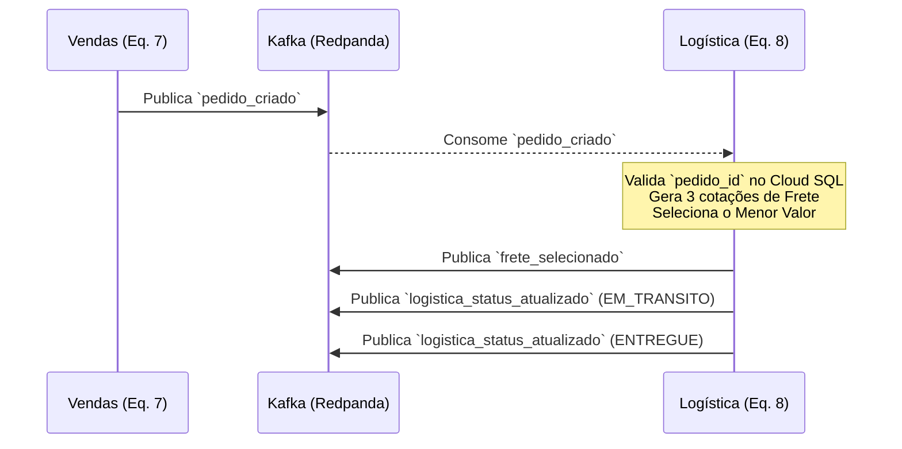

# Guia de Integração — Vendas (Eq. 7) ↔ Logística (Eq. 8)

> **Versão:** 3.0  
> **Autor:** Equipe 8 — Logística (`logistica-service`)  
> **Data:** 2026-05-12  

---

## 1. Visão Geral: Automação Total

A **Equipe 8 (Logística)** absorveu toda a inteligência de cotação e roteirização. A Equipe de Vendas **não precisa mais se preocupar com cotações de frete ou escolha de transportadoras**.

O novo fluxo é **100% automatizado** do nosso lado:

1. Nós recebemos o seu evento de pedido.
2. Geramos automaticamente **3 cotações reais** com transportadoras cadastradas no banco.
3. Escolhemos a cotação de **menor preço**.
4. Processamos o despacho e simulamos a entrega automaticamente.

---

## 2. Diagrama de Fluxo (Mensageria Kafka)



---

## 3. Validação do Banco de Dados (🚨 CRUCIAL 🚨)

> [!CAUTION]
> **O `pedido_id` enviado no payload do Kafka DEVE ser um UUID válido e já estar persistido na tabela `portal_b2b.pedido` no PostgreSQL (Cloud SQL).**
> Caso o ID enviado não exista no banco de dados, a Logística **rejeitará o evento** e não conseguirá vincular nem iniciar a entrega.

---

## 4. Tópico Kafka: `pedido_criado` (O que vocês publicam)

Este é o **único evento** que a Equipe de Vendas deve publicar.

### Simplificação do Payload

> [!TIP]
> O campo **`tipo_veiculo` foi removido** do payload que vocês precisam enviar. A Logística agora faz a triagem inteligente e automática do veículo ideal baseada apenas no `peso_carga`. Menos campos, menos chance de erro!

### Envelope Obrigatório

```json
{
  "eventId": "<UUID v4>",
  "eventType": "pedido_criado",
  "eventVersion": "1.0",
  "timestamp": "2026-05-12T10:00:00.000Z",
  "source": "vendas-service",
  "correlationId": "<UUID v4>",
  "payload": {
    "pedido_id": "550e8400-e29b-41d4-a716-446655440000",
    "tipo_transporte": "RODOVIARIO",
    "peso_carga": 2500.00,
    "cep_origem": "74000000",
    "cep_destino": "01001000"
  }
}
```

| Campo | Tipo | Obrigatório | Descrição |
|-------|------|:-----------:|-----------|
| `pedido_id` | `string (UUID)` | ✅ | ID do pedido já salvo no Cloud SQL. |
| `tipo_transporte` | `string` | ✅ | `RODOVIARIO`, `AEREO` ou `MARITIMO`. |
| `peso_carga` | `number` | ✅ | Peso em **kg** para a nossa triagem automática de veículo. |
| `cep_origem` | `string` | ✅ | CEP de coleta (8 dígitos). |
| `cep_destino` | `string` | ✅ | CEP de entrega (8 dígitos). |

---

## 5. Visualização de Rastreio e Tempos de Simulação

Durante os testes conjuntos, vocês não precisam ficar adivinhando se o sistema travou. Acompanhem tudo em tempo real através do nosso **Dashboard Oficial**:

-> **Acesse o Logística Dashboard:** [http://34.8.17.245:3000/](http://34.8.17.245:3000/)

Lá, vocês verão o status do pedido evoluir perfeitamente de acordo com esta tabela de tempo fixa:

| Status | Tempo | O que acontece |
|--------|:---:|----------------|
| `AGUARDANDO` | 0s | Evento recebido, aguardando cotações e seleção. |
| `SELECIONADO` | ~5s | Menor valor escolhido e persistido no BD. |
| `EM_TRANSITO` | **10s** (após seleção) | Carga simulada em movimento. |
| `ENTREGUE` | **20s** (após trânsito) | Carga chega ao destino final. Fluxo encerrado! |

---

## 6. Configuração de Infraestrutura

Todos os links necessários para vocês validarem a integração do lado de Vendas:

| Recurso | Endereço |
|---------|----------|
| **Logística Dashboard (Visualização)** | `http://34.8.17.245:3000/` |
| **Kafka (Redpanda Brokers)** | `redpanda:9092` (rede Docker interna) |
| **Kafka UI (Verificação de Tópicos)** | `http://34.29.84.207:8080` |
| **Database (Cloud SQL)** | `136.114.235.212:5432` |
| **Logística API (Gateway REST)** | `http://34.8.17.245/api/logistica/` |

---

> **Dúvidas?** A integração foi desenhada para ser o mais simples possível para Vendas. Mas se precisarem de apoio nos testes, chamem a Equipe 8!
